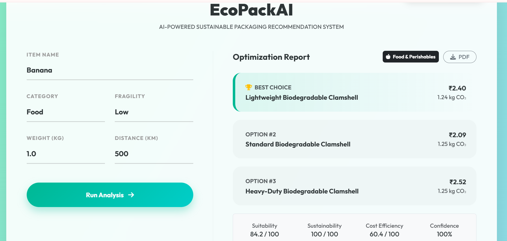
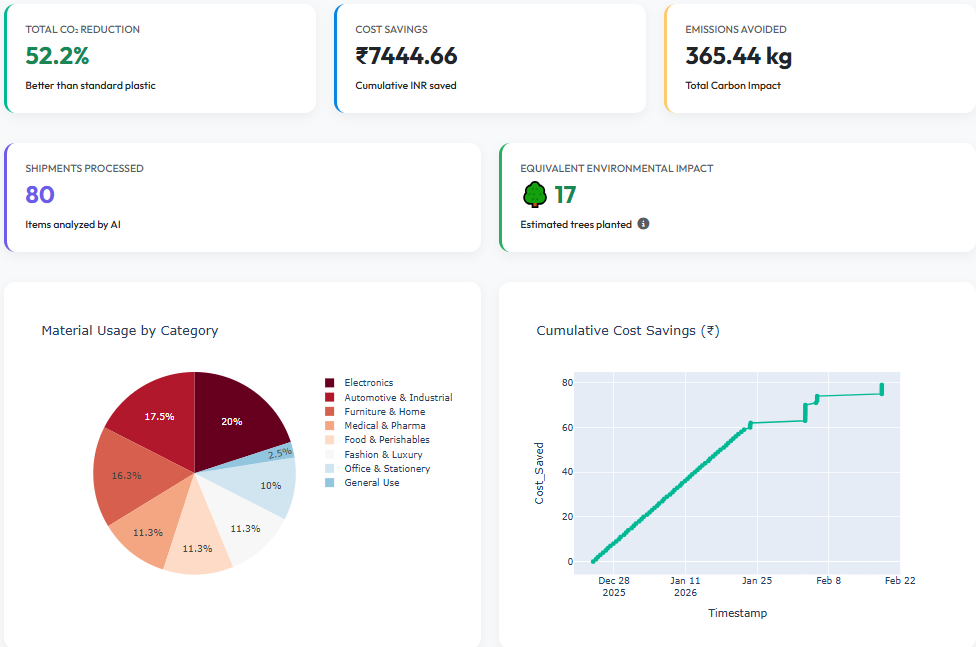

# 🌿 EcoPackAI: Sustainable Logistics Optimization


> **Empowering logistics with AI-driven, eco-friendly packaging decisions.**
> *Reduced Carbon Footprint. Optimized Costs. Smarter Supply Chains.*

---

## 🚀 The Problem
The e-commerce and logistics sectors contribute significantly to global waste.
* **Over-packaging** leads to unnecessary shipping costs and material waste.
* **Wrong material choices** increase CO₂ emissions and environmental impact.
* Businesses lack **real-time data** to make sustainable decisions instantly.

## 💡 Our Solution: EcoPackAI
EcoPackAI is a lightweight, web-based tool that instantly recommends the optimal packaging material based on:
1.  **Item Category** (Electronics, Food, Fragile, etc.)
2.  **Weight & Distance**
3.  **Fragility Level**

It calculates the **Cost vs. Carbon Footprint** trade-off and compares it against standard plastic packaging to show you exactly how much money and CO₂ you save per shipment.

---

## ✨ Key Features

### 📦 Smart Recommendation Engine
* Instantly identifies the best sustainable material (e.g., Recycled Cardboard, Mushroom Packaging, Cornstarch Peanuts).
* Considers shipping distance and item weight for accurate impact analysis.

### 📊 Live Analytics Dashboard
* Tracks cumulative **CO₂ saved** and **Cost saved** across all shipments.
* Visualizes material usage trends with interactive **Plotly charts**.
* **Gamified Impact:** Shows "Trees Planted" equivalent to motivate users.

### ⚡ Lightning Fast & Lightweight
* Optimized for performance on edge devices.
* No heavy GPU requirements—runs instantly on any standard server.
* **Zero-Shot Logic:** Uses intelligent keyword mapping for instant categorization without heavy model downloads.

### 📄 Reporting
* Generate **PDF reports** for logistics managers.
* Export usage logs for sustainability auditing.

---

## 🛠️ Tech Stack

* **Frontend:** HTML5, Bootstrap 5, JavaScript (Canvas Confetti, Plotly.js)
* **Backend:** Python, Flask
* **Data Processing:** Pandas
* **Deployment:** Render (Gunicorn Production Server)

---

## 📸 Screenshots

### 1. The Prediction Interface


### 2. The Analytics Dashboard


---

## 🚀 How to Run Locally

To run this project on your local machine, follow these steps:

### 1. Clone the Repository

```bash
git clone https://github.com/RutujaWaghmare-21/Ecopack-Ai-Optimizer
```

### 2. Install Dependencies

Make sure you have Python installed.

```bash
pip install -r requirements.txt
```

### 3. Run the App

```bash
python app.py
```

### 4. Open in Browser

Visit:

http://127.0.0.1:5000

## 🌍 Live Deployment

The application is deployed on Render:

🔗 https://ecopack-ai-optimizer.onrender.com

## 🔮 Future Roadmap

- [ ] Integration with real-time shipping APIs (FedEx / DHL)
- [ ] Image recognition to auto-detect item category
- [ ] User accounts for multi-tenant logistics companies

---

## 🤝 Contributing

Contributions are welcome!  
Please open an issue or submit a pull request.

---

## 📄 License

This project is licensed under the MIT License — see the `LICENSE` file for details.
