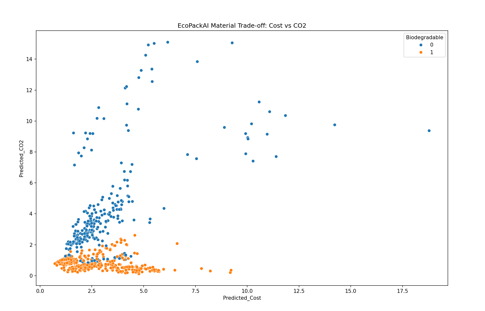
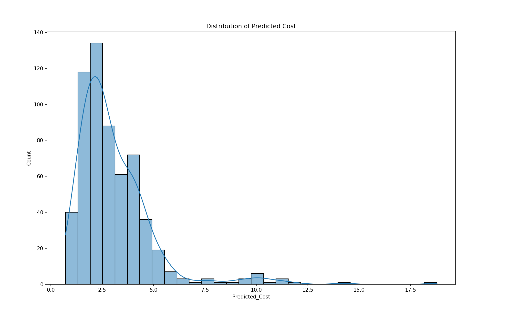

# EcoPackAI
# 🌱 EcoPackAI – Sustainable Material Recommendation System

EcoPackAI is a machine learning–based project designed to recommend eco-friendly and cost-effective packaging materials by analyzing material properties such as density, tensile strength, cost, CO₂ emissions, and biodegradability.

The system predicts **material cost** and **CO₂ emissions**, computes a **final sustainability ranking**, and visualizes trade-offs to support data-driven material selection.

---

## 🚀 Features

- 📊 Data preprocessing and feature engineering
- 🤖 Machine learning models:
  - Random Forest Regressor (Cost Prediction)
  - XGBoost Regressor (CO₂ Emission Prediction)
- 📈 Model evaluation using RMSE, MAE, and R²
- 🧮 Composite sustainability ranking score
- 📉 Visual analysis of cost vs CO₂ trade-offs
- 🧪 Clean, modular, and scalable code structure

---

## 🗂 Project Structure
EcoPackAI/
│
├── data/
│ └── materials_database_600.xlsx
│
├── src/
│ ├── main.py
│ ├── preprocessing.py
│ ├── models.py
│ └── evaluation.py
│
├── requirements.txt
└── README.md


---
Code 

## 🧠 Machine Learning Workflow

1. **Data Loading**
   - Reads material data from Excel file

2. **Data Preprocessing**
   - Handles missing values
   - Encodes categorical features
   - Performs feature engineering

3. **Model Training**
   - Random Forest for cost prediction
   - XGBoost for CO₂ emission prediction

4. **Evaluation**
   - RMSE
   - MAE
   - R² Score

5. **Final Ranking**
   - Combines predictions with sustainability metrics

---

## 🧪 Feature Engineering

The following custom features are created:

- **CO2_Impact_Index**  
  `CO2_Emission_kg / Density_kg_m3`

- **Cost_Efficiency_Index**  
  `Tensile_Strength_MPa / Cost_per_kg`

- **Material_Suitability_Score**  
  `(Biodegradable × 2)`

- **Cost_Efficiency_Index**
   "CO2_Impact_Index"


---

## 📊 Visualizations

- Scatter plot: **Predicted Cost vs Predicted CO₂**
- Histogram: **Distribution of Predicted Cost**

These plots help identify optimal materials that balance sustainability and affordability.

---

## ⚙️ Installation & Setup

### 1️⃣ Clone the repository
```bash
git clone <repository-url>
cd EcoPackAI

Install Dependencies 
pip install -r requirements.txt

Run the Project 
cd src 
python main.py


📦 Dependencies

Python 3.8+

pandas

numpy

matplotlib

seaborn

scikit-learn

xgboost

openpyxl

📌 Use Cases

Sustainable packaging material selection

Green manufacturing analysis

Cost vs environmental impact optimization

Academic and industrial research

🔮 Future Enhancements

🌐 Web application using Streamlit or Flask

💾 Model persistence with joblib

📊 Interactive dashboards

☁️ Cloud deployment

🔍 User-defined material constraints

👤 Author

Chandramouli Garikina
Data Science & Machine Learning Enthusiast

📄 License

This project is for educational and research purposes.


---

If you want, I can also:
- 🔹 Customize this for **GitHub portfolio**
- 🔹 Add **badges (Python, ML, License)**
- 🔹 Rewrite it in **resume-friendly format**
- 🔹 Create a **project report (PDF)**

Just tell me 😊




